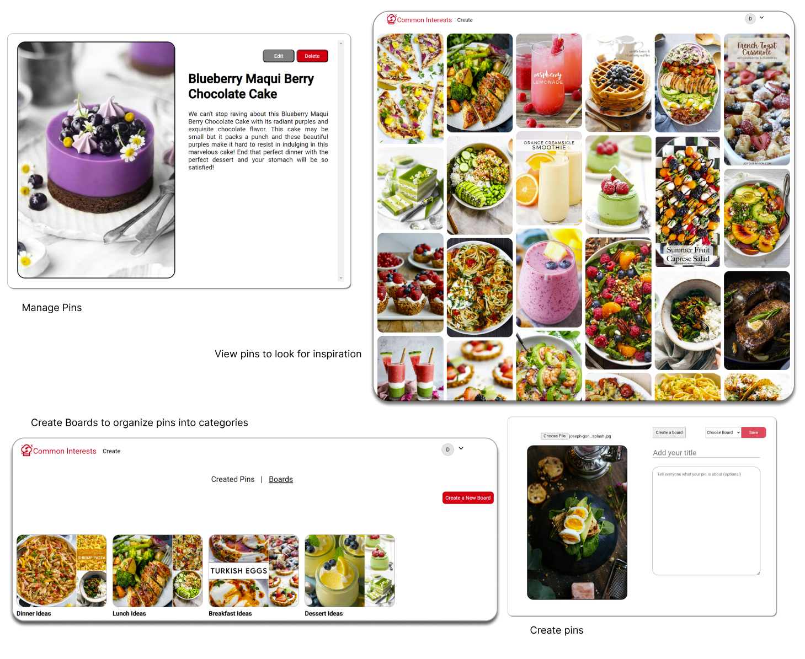

# Common Interests

This is a full-stack clone of Pinterest with a focus on culinary ideas and recipes. With this application, users can effortlessly curate and explore their food inspiration.

Check out my site Common Interests [here](https://common-interests.onrender.com/)





## Technologies Used


## Getting started

1. Clone this repository:
   ```
   https://github.com/lee2278/Pinterest-Clone.git
   ```
2. Install dependencies

   ```bash
   pipenv install -r requirements.txt
   ```

3. Create a **.env** file based on the example with proper settings for your
   development environment

4. Make sure the SQLite3 database connection URL is in the **.env** file

5. This starter organizes all tables inside the `flask_schema` schema, defined
   by the `SCHEMA` environment variable. Replace the value for
   `SCHEMA` with a unique name, **making sure you use the snake_case
   convention**.

6. Get into your pipenv, migrate your database, seed your database, and run your Flask app

   ```bash
   pipenv shell
   ```

   ```bash
   flask db upgrade
   ```

   ```bash
   flask seed all
   ```

   ```bash
   flask run
   ```

7. To run the React App in development, checkout the [README](./react-app/README.md) inside the `react-app` directory.

8. For setting up AWS, refer to this [guide](https://docs.aws.amazon.com/AmazonS3/latest/userguide/creating-bucket.html)

## Core Features

### Pins
- Users can create pins
- Users can view all pins
- Users can edit their pins
- Users may delete their pins

### Boards
- Users can create boards for organizing
- Users can view all their created boards
- Users can edit their boards
- Users can delete their boards

### AWS
- Users can upload images for their pins

### Future Features
- Saved
   - Users can save any pin and be able to view and manage pins they've saved
- Likes
   - Users can like/unlike pins
- Comments
   - Users can comment on pins, edit comments or delete comments
- Search Bar
   - Users can search for pins and view their searches
- Profile
   - Users can create and edit their profile 
