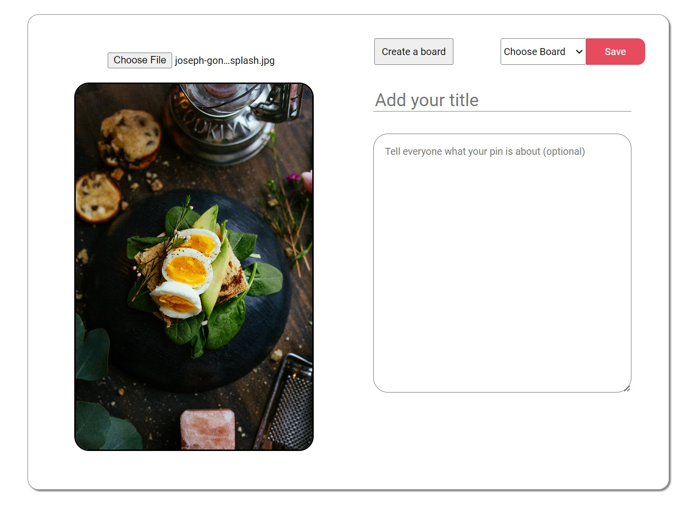

# Common Interests

This is a full-stack clone of Pinterest with a focus on culinary ideas and recipes. With this application, users can effortlessly curate and explore their food inspiration.

Check out my site Common Interests [here](https://common-interests.onrender.com/)





## Technologies Used


## Getting started

1. Clone this repository:
   ```
   https://github.com/lee2278/Pinterest-Clone.git
   ```
2. Install dependencies

   ```bash
   pipenv install -r requirements.txt
   ```

3. Create a **.env** file based on the example with proper settings for your
   development environment

4. Make sure the SQLite3 database connection URL is in the **.env** file

5. This starter organizes all tables inside the `flask_schema` schema, defined
   by the `SCHEMA` environment variable. Replace the value for
   `SCHEMA` with a unique name, **making sure you use the snake_case
   convention**.

6. Get into your pipenv, migrate your database, seed your database, and run your Flask app

   ```bash
   pipenv shell
   ```

   ```bash
   flask db upgrade
   ```

   ```bash
   flask seed all
   ```

   ```bash
   flask run
   ```

7. To run the React App in development, checkout the [README](./react-app/README.md) inside the `react-app` directory.

8. For setting up AWS, refer to this [guide](https://docs.aws.amazon.com/AmazonS3/latest/userguide/creating-bucket.html)

## Core Features

### Pins
- Users can create pins
- Users can view all pins
- Users can edit their pins
- Users may delete their pins

### Boards
- Users can create boards for organizing
- Users can view all their created boards
- Users can edit their boards
- Users can delete their boards

### Comments
- Users can create comments on pins
- Users can view all comments made on pins
- Users can edit their comments
- Users can delete their comments

### Saves
- Users can save pins by itself or onto boards
- Users can view their saves
- Users can delete things they've saved

### AWS
- Users can upload images for their pins

### Search Bar
- Users can search for pins and view their searches

### Future Features

- Profile
   - Users can create and edit their profile 
- Following
   - Users can follow other users and filter pins by their followed
   - Perhaps have implement live chat

## Endpoints

| Request | Purpose | Return Value|
|---------|---------|-------------|
|GET/api/auth| This fetch checks to see if a user is authenticated and if so returns the user as a dictionary. If not authenticated, it returns a dictionary with key of errors and a list value of Unauthorized  | {<br/>"id": INTEGER,<br/>"username": STRING,<br/>"email": STRING, <br/> "hashedPassword": STRING, <br/>} <br/> or <br/>{'errors': ['Unauthorized']}|
|POST/api/auth/login| This fetch adds a user to the session so that user is logged in| {<br/>"id": INTEGER,<br/>"username": STRING,<br/>"email": STRING, <br/> "hashedPassword": STRING, <br/>}|
|GET/api/auth/logout| This fetch removes a user from a session, logging the user out| {'message': 'User logged out'}|
|POST/api/auth/signup| This fetch creates a new user and logs them in| {<br/>"id": INTEGER,<br/>"username": STRING,<br/>"email": STRING, <br/> "hashedPassword": STRING, <br/>}|
|GET/api/auth/unauthorized| This fetch returns unauthorized JSON when flask-login authentication fails| {'errors': ['Unauthorized']}|
|GET/api/users| This fetch queries for all users and returns them in a list of user dictionaries | [{<br/>"id": INTEGER,<br/>"username": STRING,<br/>"email": STRING, <br/> "hashedPassword": STRING, <br/>}]|
|GET/api/users/:id| This fetch queries for a user by id and returns that user in a dictionary | {<br/>"id": INTEGER,<br/>"username": STRING,<br/>"email": STRING, <br/> "hashedPassword": STRING, <br/>}|
|GET/api/pins| This fetch queries for all pins and returns them in a list of pin dictionaries | [{<br/>"id": INTEGER,<br/>"owner_id": INTEGER,<br/>"title": STRING, <br/> "description": STRING, <br/> "image_url": STRING <br/> }]|
|POST/api/pins| This fetch creates a new pin and returns it as a dictionary | {<br/>"id": INTEGER,<br/>"owner_id": INTEGER,<br/>"title": STRING, <br/> "description": STRING, <br/> "image_url": STRING <br/> }|
|GET/api/pins/:id| This fetch queries for a pin by id and returns that pin in a dictionary | {<br/>"id": INTEGER,<br/>"owner_id": INTEGER,<br/>"title": STRING, <br/> "description": STRING, <br/> "image_url": STRING <br/> }|
|PUT/api/pins/:id| This fetch queries for a pin by id, updates it, and returns that pin in a dictionary | {<br/>"id": INTEGER,<br/>"owner_id": INTEGER,<br/>"title": STRING, <br/> "description": STRING, <br/> "image_url": STRING <br/> }|
|DELETE/api/pins/:id| This fetch queries for a pin by id and deletes that pin | {"message" : "Successfully deleted"}|
|PUT/api/pins/:id/add-board| This fetch queries for a pin by id and appends a board to that pin| {<br/>"id": INTEGER,<br/>"owner_id": INTEGER,<br/>"title": STRING, <br/> "description": STRING, <br/> "image_url": STRING, <br/> "boards" : [{<br/>"id": INTEGER, <br/> "name": STRING,<br/> "description": STRING }]   <br/> }|
|GET/api/pins/search/:search| This fetch queries for all pins that match a search and returns them in a list of pin dictionaries | [{<br/>"id": INTEGER,<br/>"owner_id": INTEGER,<br/>"title": STRING, <br/> "description": STRING, <br/> "image_url": STRING <br/> }]|
|GET/api/boards| This fetch queries for all boards and returns them in a list of board dictionaries | [{<br/>"id": INTEGER,<br/>"user_id": INTEGER,<br/>"name": STRING, <br/> "description": STRING, <br/>}]|
|GET/api/boards/:id| This fetch queries for a board by id and returns that board in a dictionary | {<br/>"id": INTEGER,<br/>"user_id": INTEGER,<br/>"name": STRING, <br/> "description": STRING, <br/>}|
|POST/api/boards/:id| This fetch creates a new board and returns it as a dictionary | {<br/>"id": INTEGER,<br/>"user_id": INTEGER,<br/>"name": STRING, <br/> "description": STRING, <br/>}|
|PUT/api/boards/:id| This fetch queries for a board by id, updates it, and returns that board as a dictionary | {<br/>"id": INTEGER,<br/>"user_id": INTEGER,<br/>"name": STRING, <br/> "description": STRING, <br/>}|
|DELETE/api/boards/:id| This fetch queries for a board by id and deletes that board | {"message" : "Successfully deleted"}|
|DELETE/api/boards/:boardId/remove-pin/:pinId| This fetch queries for a board by id and removes a pin from that board | {"message" : "Successfully deleted"}|
|GET/api/saves| This fetch queries for all saves and returns them in a list of save dictionaries | [{<br/>"id": INTEGER,<br/>"user_id": INTEGER,<br/>"pin_id": INTEGER, <br/> }]|
|POST/api/saves| This fetch creates a new save and returns it as a dictionary | {<br/>"id": INTEGER,<br/>"user_id": INTEGER,<br/>"pin_id": INTEGER, <br/> }|
|DELETE/api/saves/:id| This fetch queries a save by id and deletes the save | {"message": "Successfully deleted"}|
|GET/api/comments| This fetch queries for all comments and returns them in a list of comment dictionaries | [{<br/>"id": INTEGER,<br/>"user_id": INTEGER,<br/>"pin_id": INTEGER, <br/>"comment": STRING <br/>}]|
|POST/api/comments| This fetch creates a new comment and returns it as a dictionary | {<br/>"id": INTEGER,<br/>"user_id": INTEGER,<br/>"pin_id": INTEGER, <br/>"comment": STRING <br/>}|
|PUT/api/comments/:id| This fetch updates an existing comment and returns it as a dictionary | {<br/>"id": INTEGER,<br/>"user_id": INTEGER,<br/>"pin_id": INTEGER, <br/>"comment": STRING <br/>}|
|DELETE/api/comments/:id| This fetch queries a comment by id and deletes the comment | {"message": "Successfully deleted"}|
